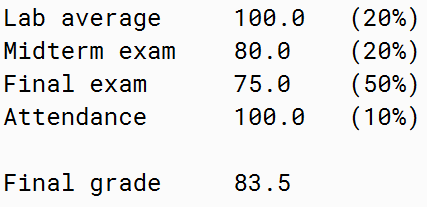
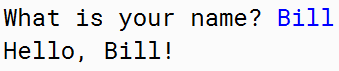

# Lesson 1 - Introduction to Java

## lesson 1.1 - Using Java and ~BlueJ~

> why not VSCode?

* **Lessons** . There are several lessons, comprising several smaller pages. Each page discusses a particular topic.
* **Review questions** are provided for you to practice
  what you have learned. Your answers to the review questions won't be
  checked by anyone, and you don't have to hand them in. However, if you
  need help with them, you are welcome to ask the course tutor.
* **Exercises** . There are four exercises in total which you need to complete and submit (via this system).
* **Final exam** . At the end of the course there will be a final exam so we can check you have learned enough to earn the course credit.

## lesson 1.2 -Java Language Basics

1. you must use a semi-colon at the end of every Java statement
2. the small letter and the big letter (e.g. **a** and **A**)are not treated as the same letter in Java.

   ```java
   lengthofstudy = 2 + 2;
   lengthOfStudy = 2 + 2;
   ```
3. Use of Spacing

   ```java
   System.out.println("Hello world!")
   System.out.println(   "hello world!") // the same
   System.out.   println("hello world!) // error
   ```
4. Using Multiple Lines

   ```java
   finalgrade = (lab1+lab2+lab3+lab4+lab5+lab6)/6.0*0.2+midtermexam*0.2+finalexam*0.5+attendance*0.1;
   finalgrade = (lab1 +
                 lab2 +
                 lab3 +
                 lab4 +
                 lab5 +
                 lab6) / 6.0 * 0.2 +
                midtermexam  * 0.2 +
                finalexam    * 0.5 +
                attendance   * 0.1; // the same, but more readable
   ```

   You probably know from other programming languages that the spacing in front of the code is called ***indentation*** . Indentation is very important in distinguishing between different blocks of code. I**t is very often that Java statements are arranged into many different levels of block**
5. two different ways to write comments in Java

   ```java
   /* I am a comment */
   // I am a comment
   ```
6. Java provides many tools that we can use to do various kinds of thing.Java typically puts each group of similar tools in a ***Java Package*** .Let's say you want to open and read a file in your program you will need to use the *File *tool.**

   ```java
   import java.io.*; // means 'everything' in the programming world
   import java.io.File; /*if you only want to use File from the java.io package, the following code helps you import File from the package.*/
   ```

## lesson 1.3 Variables and Operators

1. How to use variables

   ```java
   // Declare a variable before using it
   int luckynumber;
   /* This line of code, telling Java that you are going to use a variable, is called variable declaration. */
   // Then you can use it to store number
   luckynumber = 5;
   ```

| Data type name    |                            Description                            |
| ----------------- | :----------------------------------------------------------------: |
| **char**    |                         A single character                         |
| **int**     |                         An integer number                         |
| **float**   |                      A floating point number                      |
| **double**  | A floating point number with a doubly higher precision than float |
| **boolean** | A boolean value, meaning either **true** or **false** |
| **String**  |                           A string value                           |

> Warning: A variable name must start with a **letter, a dollar sign or an underscore** (i.e., _ ), followed by any combination of **letters, digits, dollar signs or underscores.**

    What will happen if we create an integer variable and then put 1.2 into the variable? Let's see with the following code:

```java
   int luckynumber;
   luckynumber = 1.2; // incompatiable error: ...
   luckynumber = (int) (1.2); // correct!
```

2. Arithmetic Operators

| Operator |       Description       |
| :------: | :---------------------: |
|    +    |        Addition        |
|    -    |       Subtraction       |
|    *    |     Multiplication     |
|    /    |        Division        |
|    %    |        Remainder        |
|    ++    | Increasing a value by 1 |
|    --    | Decreasing a value by 1 |

```java
greeting = "Good" + " " + "morning" + "!";
```

3. Integer Division

```java
int luckynumber;
luckynumber = 5/2; // you may expect that Java will also give you 2.5. Instead, It gives you a result of 2
double real_one;
real_one = 5.0/2;
real_one = 5.0/2;
real_one = (double)5/2; // those three are just what you are looking for
```

4. Comparison Operators

|   Operator   |       Description       |
| :----------: | :----------------------: |
| **==** |         Equal to         |
| **!=** |       Not equal to       |
| **>** |       Greater than       |
| **>=** | Greater than or equal to |
| **<** |       Smaller than       |
| **<=** | Smaller than or equal to |

```java
a == b // If a and b are equal, the above expression will give a value of true. Otherwise, it will give a value of false.
```

5. The Assignment Operator

   ```java
   luckynumber = 5;
   ```
6. Conditional Operators

| **Operator** |   Description   |
| :----------------: | :-------------: |
|    **&&**    | Conditional AND |
|        \|\|        | Conditional OR |
|    **!**    |    Negation    |

```java
number > 5 && number < 10
5 < number < 10 // error 
```

```java
!(number > 10) // you have to use a pair of parathenses to enclose the expression
```

## lesson 1.4 - Text Input and Output

1. Printing text

```java
System.out.println("Hey, how are you doing?");
```

```java
System.out.println("My name is: ");
System.out.print("Java!");
/* The result is:
My name is:
Java! */
```

```java
System.out.print("My name is: ");
System.out.print("Java!");
/* The result is:
My name is Java! */
```

2. Printing variables

```java
System.out.println(luckynumber); // instead of printing the text "luckynumber", it will print the content of the variable
```

If we want to we can even adjust the spacing so that the final grade summary becomes a table.
What we have done is to use the tab character ( \t ) to align the numbers and print the contribution of each row. Here is the code:

```java
System.out.print("Lab average\t");
System.out.print(labs);
System.out.println("\t(20%)");
System.out.print("Midterm exam\t");
System.out.print(midtermexam);
System.out.println("\t(20%)");
System.out.print("Final exam\t");
System.out.print(finalexam);
System.out.println("\t(50%)");
System.out.print("Attendance\t");
System.out.print(attendance);
System.out.println("\t(10%)");
System.out.println();
System.out.print("Final grade\t");
System.out.println(finalgrade);
```



```java
System.out.println(); // If you don't give anything for println to print it will print an empty line.
```

3. Getting input from users

Instead of using **System.in** directly, we use a tool called **Scanner** to handle the keyboard input.

```java
import java.util.scanner; // import the tool we need
Scanner scanner = new Scanner(System.in); // We will explain more about creating things using new later in the course.
```

As you can see from the code, we give **System.in** to  **Scanner** **, meaning that we want to get things from the keyboard.**

```java
// Create the scanner from the input
Scanner scanner = new Scanner(System.in);

// Ask the user for his/her name
System.out.print("What is your name? ");

// Wait for the input and store it in the variable name
String name = scanner.next();

// Say hello to the user
System.out.println("Hello, " + name + "!");
```



> Warning: it reads what the user has typed up until an **Enter key** or when there is a **space** in the text, so the space will not be stored in the variable. **The text after the space will then get picked up by another next() command in the program, if there is one.**
