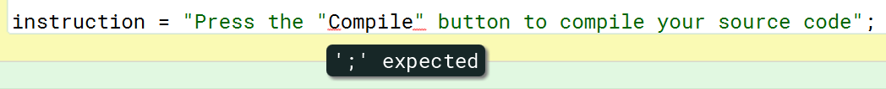
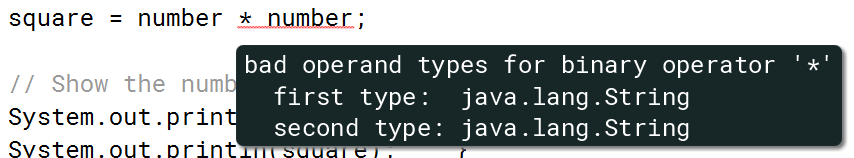
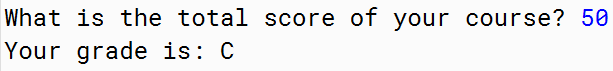
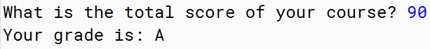
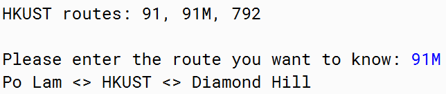
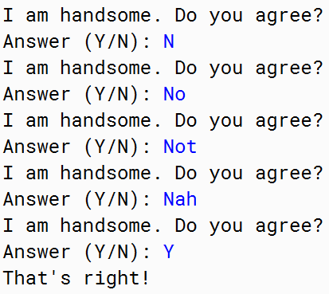

# Lesson 2 - Essential Programming in Java

## lesson 2.1 - Using Strings

1.Using strings

We have seen the use of strings when we talked about variables. Here is the example we have looked at:

```java
// Declare the variable before using it
String name;

// Put the name into a variable
name = "Lucky";
```

2.The use of single and double quotes

```java
// Declare a string variable
String letterA;
// What will happen if we try to use single quotes to enclose the character?
letterA = 'A';
// Type mismatch: cannot convert from char to String
```

> In Java, **single quotes are used for** **char** only. When you specify a string you enclose it using a pair of **double quotes**.

3.Putting double quotes into a string

```java
instruction = "Press the "Compile" button to compile your source code";
```



First, Java starts to read the code from left to right. When Java reads the first double quote it considers the double quote as the start of a string. Then it continues to read the content of the string until it reaches the second double quote.

> **The compiler can not truly understand what you are talking about! It just read your instruction word by word!**

**So how can we put double quotes inside a string?**

```java
instruction = "Press the \"compile\" button to compile your source code";
// Similarly, if you want to put a single quote inside a char variable, you can use \'
char quote = '\'';
```

4.Converting strings to other data types

```java
String number = "2";
// Calculate the square of the number
int square;
square = number * number;

// Show the number
System.out.print("The square of the number is: ");
System.out.println(square);
```



What is the meaning of this error?This error means **Java does not know how to use the** * **operator on the** **number** **variable because it is a string variable.**

However, you can convert a string to an integer **using the** **Integer.parseInt** **command**

```java
// Convert the string to an integer
int integer_number;
integer_number = Integer.parseInt(number);

// Calculate the square of the number
int square;
square = integer_number * integer_number;

// Show the number
System.out.print("The square of the number is: ");
System.out.println(square);
```

> Also you can use Float.parseFloat or Double.parseDouble to convert a string variable to float or double.
>
> Note that the **String.valueOf** command changes a **char** **value** to a **String** **value**

5.Getting the Length of Strings

```java
// Ask for the name
System.out.print("What is your name? ");

// Get the name input
String name;
Scanner scanner = new Scanner(System.in);
name = scanner.next();

// Show the length of the name
System.out.println("Your name is " + name.length() + " characters long.");
```

6.lookong into the content of a string

Another useful command that you can use for a string is the **.charAt()** command. This command allows you to get a character from a string at a particular position.

```java
String name = "Lucky";
```

| Position            | 0 | 1 | 2 | 3 | 4 |
| ------------------- | - | - | - | - | - |
| **Character** | L | u | c | k | y |

```java
// Use a char variable
char letterU;

// Store the second character into the variable
letterU = name.charAt(1);
```

## lesson 2.2 - Making Decisions

1.Using the if...else statement

```java
// Print a message based on the score value
if (score > 80) {
    System.out.println("Excellent! You have done a great job!");
}
else {
    System.out.println("Good job! You can do better next time!");
}
```

> In Java, the if statement is written using the **if** command, which has the condition put inside a pair of **brackets**, and a block of code that will be executed if the condition is true. Remember that we use a pair of braces **{}** to enclose a block of code.

```java
// Get the total score
String inputscore;
System.out.print("What is the total score of your course? ");
Scanner scanner = new Scanner(System.in);
inputscore = scanner.next();

// Convert the score to a number
int score = Integer.parseInt(inputscore);
// Handle the A grade
if (score >= 80) {
    System.out.println("A");
}
// Handle the B grade
if (score >= 60 && score < 80) {
    System.out.println("B");
}
// Handle the C grade
if (score >= 40 && score < 60) {
    System.out.println("C");
}

// Handle the D grade
if (score < 40) {
    System.out.println("D");
}
```

Using four if statements in the example work without any problem. However, you probably already
know that these if statements can be 'simplified' using a series of **if...else** statements.

```java
// Get the total score
String inputscore;
System.out.print("What is the total score of your course? ");
Scanner scanner = new Scanner(System.in);
inputscore = scanner.next();

// Convert the score to a number
int score = Integer.parseInt(inputscore);
// Handle the A grade
if (score >= 80) {
    System.out.println("A");
}
// Handle the B grade
else if (score >= 60) {
    System.out.println("B");
}
// Handle the C grade
else if (score >= 40) {
    System.out.println("C");
}

// Handle the D grade
else {
    System.out.println("D");
}
```





2.Using the switch statement

For example, here is a program showing the bus route information from/to HKUST.

```java
// Get the route number
System.out.println("HKUST routes: 91, 91M, 792");
System.out.println();
System.out.print("Please enter the route you want to know: ");
String number;
Scanner scanner = new Scanner(System.in);
number = scanner.next();

// Show the information of route 91
if (number.equals("91")) {
    System.out.println("Clear Water Bay <> HKUST <> Diamond Hill");
}
// Show the information of route 91M
else if (number.equals("91M")) {
    System.out.println("Po Lam <> HKUST <> Diamond Hill");
}
// Show the information of route 792
else if (number.equals("792")) {
    System.out.println("Sai Kung <> HKUST <> Tseung Kwan O");
}
// No such route
else {
    System.out.println("Bus route does not exist");
}
```

The above code works well. However, the if statements are a little bit hard to read.
Java provides another way of writing conditions for this situation.

```java
switch (number) {
    case "91": // Show the information of route 91
        System.out.println("Clear Water Bay <> HKUST <> Diamond Hill");
        break;
    case "91M": // Show the information of route 91M
        System.out.println("Po Lam <> HKUST <> Diamond Hill");
        break;
    case "792": // Show the information of route 792
        System.out.println("Sai Kung <> HKUST <> Tseung Kwan O");
        break;
    default: // No such route
        System.out.println("Bus route does not exist");
}
```



> If none of the cases matches the value of the variable the switch statement runs the 'default' code. In the example, it uses the code under the default statement to show the message **"Bus route does not exist"** .

## lesson 2.3 - Loops

1.Loops in java

Similar to other programming languages you can write loops in Java. Looping is an important structure in programming. Java allows you to use three kinds of loops:

* For loops
* While loops
* Do while loops

2.Using for loops

```java
for (i = 1; i < 11; i++) {
    System.out.println(i);
}
```

A for loop is typically used when you know exactly how many times you need to run your loopb body. In the next part we will look at while loops, which are typically used when the emphasis is put on *when do you want to stop a loop* instead of  *how many times you want to run the loop* **.**

3.Using while loops

```java
// Show the question
System.out.println("I am handsome. Do you agree?");
System.out.print("Answer (Y/N): ");

// Ask for the answer
String answer;
Scanner scanner = new Scanner(System.in);
answer = scanner.next();

// Ask the question if the answer is not 'Y'
while (!answer.equals("Y")) {
    System.out.println("Can't hear you. Please answer again.");
    System.out.print("Answer (Y/N): ");
    answer = scanner.next();
}

System.out.println("That's right!");
```



4.Using do while loops

A while loop is written like this:

```java
while (condition){
    ...
}
```

Since the loop condition is specified before the loop body, the condition is evaluated **before** running the loop content. Let's see how a do while loop is written, as shown below:

```java
do {
    . . .
} while (condition);
```

Let's use a do while loop to rewrite our silly question example. Here is the code:

```java
// Prepare the scanner
Scanner scanner = new Scanner(System.in);

// Keep asking the question if the answer is not 'Y'
String answer;
do {
    // Show the question
    System.out.println("I am handsome. Do you agree?");
    System.out.print("Answer (Y/N): ");

    // Ask for the answer
    answer = scanner.next();
} while (!answer.equals("Y"));

System.out.println("That's right!");
```

As you can see, the above program asks the question inside the loop. The program doesn't need to
ask the question before entering the loop.

4.Review quesion

**Which one of the following code produces a different output compared to the others?**

```java
int i;
for (i = 0; i <= 10; i++) {
    System.out.print(i);
}
```

```java
String numbers = "012345678910";
int i = 0;
do {
    System.out.print(numbers.charAt(i));
    i++;
} while (i < numbers.length());
```

```java
int i;
i = 0;
while (i < 10) {
    System.out.print(i);
    i = i + 1;
}
```

> the answer is the third one, since the first two print "012345678910", while the thrid one print "0123456789"
