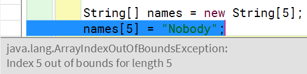

# Lesson 3 - Object-oriented Programming and Arrays

## lesson 3.1 - Basic Object - oriented Programming

1.Intro.

There are many 'objects' around us in the real world. We can say these objects have two kinds of characteristics: ***attributes*** and ***behaviours***. This way of programming, thinking using objects and their interactions, is called **object-oriented programming**. In computer science we usually call the definition of an object a ***class***. A class has its own attributes and behaviours. Behaviours of an object is usually called ***methods*** **.**

2.Object -oriented Programming in Java

Java is a language specifically designed for object-oriented programming. *Almost* everything in the java language is an object. For instance, the scanner tool that we have used to get user input:

```java
// Create a scanner object
Scanner scanner = new Scanner(System.in);

// Use the next() method of the scanner object to get a string from the user
String name = scanner.next();

// Use the length() method to show the length of the name object
System.out.println(name.length());
```

`.next()` and `.length()`  are two method from a scanner and a string respectively. We avoided using the word '*object*' previously because we have not yet talked about it. After this lesson you will have a better idea of objects. However, some of the data tupes like `int`, `char` and `double` are not objects. They contains only a single value. So that why we can use `==` to compare the values of these data types directly, and we cannot use `==` ( we use `.equals()` instead ) to compare two strings.

3.Using a Class

To create a class you use the class command. Now assumed that we want to create a Dog classs:

```java
public class Dog
```

The word `public` means the clases is accessible by every other part of the code. Following the class command, the content of the class is then put inside a block a code, i.e., attributes and methods.

```java
int weight -5; // the weight of the dog (attribute)
// Ask the dog to bark (method)
void bark() {
System.out.println("woof!");
}
```

Finally, if you have a class in your project, you can create a new dog of the `Dog` class using the following line of code:

```java
Dog lemon = new Dog();
```

Then, lemon is a variable in the abovw code. The data type of the variable is `Dog`, i.e., the variable is used to store an instance of `Dog`. The **Dog**. The **new** keyword creates a new instance of the class `Dog`.

p.s. In both Java and C++, the `new` keyword allocates memory on the heap. Java manages this memory automatically, while C++ requires manual release. C++ can also allocate objects on the stack without `new`.

## lesson 3.2 -  Class Methods

1.Putting Methods in a Class

```java
/**
 * This is the definition of the Dog2 class.
 */

public class Dog2
{
    int weight = 5; // the weight of the dog
  
    // Ask the dog to bark
    void bark() {
        System.out.println("Woof!");
    }
  
    // Feed the dog with a certain amount of food
    void feed(int food) {
        weight = weight + food;
    }
  
    // Get the current weight of the dog
    int getWeight() {
        return weight;
    }
}
```

The first method that we have added is called **feed**. The method takes an *input parameter* called **food**, which is an integer.

2.Class Constructor

You can create a special method, called *constructor*, for a class. Here, we add a constructor for the new Dog3 class:

```java
/**
 * This is the definition of the Dog3 class.
 */

public class Dog3
{
    int weight; // the weight of the dog

    // The constructor of the class
    public Dog3(int initialWeight) {
        weight = initialWeight;
    }
  
    // Ask the dog to bark
    void bark() {
        System.out.println("Woof!");
    }
  
    // Feed the dog with a certain amount of food
    void feed(int food) {
        weight = weight + food;
    }
  
    // Get the current weight of the dog
    int getWeight() {
        return weight;
    }
}
```

The following method is the constructor:

```java
// The constructor of the class
public Dog3(int initialWeight){
weight = initialWeight;
}
```

As you can see, the constructor does not have a data type and the name of the method is the same as the name of the class, in this case, `Dog3`. The constructor is automatically run when an instance of the class is created (i.e. constructed). That means it will only be run once for each object and you don't explicitly call the method in your code. Typically a constructor is used to do some initializations for the class. For example, the above constructor of the **Dog3** class initializes the weight attribute using the given parameter `initialWeight`

So where do you give the initial weight value to the class? You do it when you create the class like this:

```java
Dog3 cookie = new Dog3(10);
```

3.The main Method

Review:

```java
/**
 * This is the first program in the Java bridging course.
 */
public class HelloWorld
{
    /**
     * The main method of the program.
     */
    public static void main(String[] args)
    {
        System.out.println("Hey, how are you doing?");
    }
}
```

Here is the example that we give you in the first lesson. As  you can see the **main** method is defined inside the class. It takes an parameter called args which is an array, as shown by the brackets [], which we will discuss in *the* *next lesson.* But wait! What is the meaning of **static**? **static** changes the method to a static method, which means that you can run it without creating an instance of the classs containing the method.

When you give a program to Java the first thing Java will do is to look for the **main** method. Once Java finds the **main** method it will start the program by running this method.

## lesson 3.3 - Arrays

1.Using Arrays in Java

If you want to store a collection of things as a data structure in a single variable, in python, you can use a list to store, in C, you can use arrays. Similar to C, in Java, we store a collection of things using arrays.

Let's look at a simple Java array:

```java
String[] greeting = { "how", "are", "you", "?"};
```

The above code uses a variable `greeting` to store a collection of strings. The brackets `[]` following the data type means the variable  is a collection, i.e., an array.

Alternatively, you can create an empty array first, before putting any value inside the array. Here is an example:

```java
String[] greeting = new String[4];
greeting[0] = "how";
greeting[1] = "are";
greeting[2] = "you";
greeting[3] = "?";
```

The above few lines of code is equivalent to the line of code shown at the top of the page

> Warning if you refer to things which are not inside the array, then the error si shown in the follwing display:

```java
String[] names = new String[5];
names[5] = "Nobody";
```



2.Two Dimensional Arrays

```java
int[][] msgicsquare = { { 4, 9, 2}, {3, 5, 7}, {8, 1, 6} };
```

In the above line of code we declare and initialize an 2D array. It is two dimensional because we use one index to get the items out of the *inner* array. If we think each inner *array* as a row and the *outer* array, the `magicsquare` variable will give you this structure:

| 4      | 9      | 2      |
| ------ | ------ | ------ |
| **3** | **5** | **7** |
| **8** | **1** | **6** |

To read a value from a 2D array we use two indices, one for the row and anothor for the column. Here are some examples.

```java
System.out.println(magicsquare[1][1]); // print 5 at the center of the square
System.out.println(magicsquare[2][1]); // print 1 at the bottom of the square
```

Similarly, you can create an empty 2D array:

```java
int[][] bigarray = new int[4][5];
```

and add the items later.

p.s. if you want to verify that the values are stored in the `magicsquare` correctly, run the file magicSquare.java

3.Finding the Length of an Array

In some situations, you may not know the size of a array. What can you do if you want to read some values from an array? To do that you can use the **.length** value from an  array. Here is an example:

```java
int[] numbers = { 2, 4, 7, 1, 3, 8 };
int i, sum = 0;
for (i = 0; i < numbers.length; i++) {
    sum = sum + numbers[i];
}
System.out.println("The sum of the numbers is " + sum + ".");
```

> In Java, **.length** is an attribute of Array, and **.length()** is a method in String. Don't confuse it.
