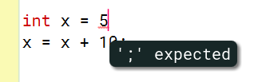
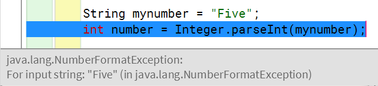
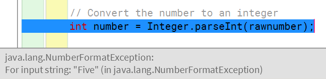
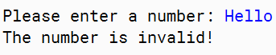
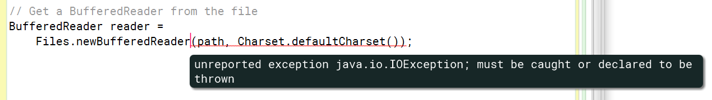

# Lesson 4 - Advanced Topics

## lesson 4.1 - Inheritance and Interfaces

In this lesson, we will very briefly discuss these two features of object-oriented programming without going into the details.

1.Inheritance

The idea of inheritance is to create a ***base class*** which contains things in common, and then create ***subclasses*** which extend the base class. These subclasses (off-springs) share the properties and behaviors of the base class but also hace things which are different from each other.

```java
/**
 * This class describes a basic shape.
 */

public class Shape
{
    // Store the position of the shape
    double x, y;

    // The constructor of a shape
    public Shape(double x, double y) {
        // 'this' refers to the object itself
        // 'this.x' means the x attribute of the object
        // while 'x' means the input parameter of the constructor
        this.x = x;
        this.y = y;
    }

    // Return the x position of the shape
    public double getPosX() {
        return x;
    }

    // Return the y position of the shape
    public double getPosY() {
        return y;
    }

    // Return the area of the shape
    public double getArea() {
        // Since the shape does not have a physical attribute,
        // the area is 0
        return 0;
    }

    // Return the circumference of the shape
    public double getCircumference() {
        // Since the shape does not have a physical attribute,
        // the circumference is 0
        return 0;
    }
}
```

Now, based on the **Shape** class we can create a **Circle** class like this:

```java
/**
 * This class describes a circle shape.
 */

public class Circle extends Shape
{
    // Store the radius of the circle
    double radius;

    // The constructor of a circle
    public Circle(double x, double y, double radius) {
        // 'super' denotes the constructor of the base class, i.e.
        // Shape(double x, double y) in the Shape class
        super(x, y);
        this.radius = radius;
    }

    // Return the radius of the side
    public double getRadius() {
        return radius;
    }

    // Return the area of the circle
    public double getArea() {
        return 3.1416 * radius * radius;
    }

    // Return the circumference of the circle
    public double getCircumference() {
        return 2 * 3.1416 * radius;
    }
}
```

Anything which has been defined in the **Shape** class will be *inherited* by the **Circle** class.

If we have the same name used by methods in the base class and the subclass, the method inside the subclass will **override** the method in the base class. (actually the methods must have the same signature, i.e., same name, same parametes, same return type)

2.Interfaces

Interfaces work in a similar way to inheritance. However:

* An interface only defines the behaviours but without the actual implementation. In terms of coding, you provide the method definitions but the methods do not have a body.
* An interface does not contain attributes
* A class can implement multiple *interfaces* but a class can only *inherit* from one base class.

Let's look at  an example.

```java
/**
 * This is the interface of anything which can be printed on the screen.
 */

public interface Printable
{
    // A behaviour of a printable object
    public void print();
}
```

The above code is an interface called **Printable.**

Let's use two classes to implement the Printabel interface.

The first class is the **StudentName** class:

```java
/**
 * This class describes the name of a student.
 */

public class StudentName implements Printable
{
    // Store the name of the student
    String firstname;
    String lastname;

    // The constructor of a student name
    public StudentName(String newfirstname, String newlastname) {
        firstname = newfirstname;
        lastname = newlastname;
    }

    // The method of the Printable interface
    public void print() {
        System.out.print(lastname + ", " + firstname);
    }
}
```

The second one is the StudentId class:

```java
/**
 * This class describes a student id.
 */

public class StudentId implements Printable
{
    // Store the id of the student
    String id;

    // The constructor of a student id
    public StudentId(String newid) {
        id = newid;
    }

    // The method of the Printable interface
    public void print() {
        System.out.print(id);
    }
}
```

So what is the use of interfaces? **Interfaces are simple 'contracts' that some classes have agreed to do.** If you know that a class has implemented a certain interface you will be able to then use those methods, specified in the interface, from the objects of the class.

## lesson 4.2 - Error Handling

1.Types fo Errors

There are basically two types of programming errors you can make in a Java program

* Syntax Errors
* Runtime Errors





In the rest of the lesson we will discuss how you can handle runtime errors.

2.Exceptions

Java calls runtime errors *exceptions*. It means something exceptional has happened while the program is running.

* NumberFormatException - when we try to convert a piece of text, which is not a number, into an integer value
* **ArithmeticException** - occurs when you attempt to perform some kind of invalid mathematical operations, such as dividing a number by zero
* **ArrayIndexOutOfBoundsException** - occurs when you try to access an item in an array using an index which is not within the size of the array
* **FileNotFoundException** - occurs when you try to open a file which does not exist
* **IOException** - occurs when you attempt to apply an illegal input/output operations, such as overwriting a protected file

3.Catching Eceptions

Let's use the following program as an example:

```java
/**
 * This example asks for an input number and calculates the square of it.
 */
import java.util.Scanner;

public class SquareWithError
{
    /**
     * The main method of the program.
     */
    public static void main(String[] args)
    {
        // Prepare a scanner
        Scanner scanner = new Scanner(System.in);

        // Ask for a number
        System.out.print("Please enter a number: ");
        String rawnumber = scanner.next();

        // Convert the number to an integer
        int number = Integer.parseInt(rawnumber);

        // Show the result
        int square = number * number;
        System.out.print("The square of the number is ");
        System.out.print(square);
        System.out.println(".");
    }
}
```

The program works fine when the user enters what is expected by the program, i.e. an integer
number. However, if the user enters something like 'Five' into the program it will have a runtime error, as shown below:



How can the programmer then prevent the program from crashing? **The solution is the catch the
potential exception using a try...catch block**.

Here is what the code looks like after using the try...catch block:

```java
try {
    // Convert the number to an integer
    int number = Integer.parseInt(rawnumber);

    // Show the result
    int square = number * number;
    System.out.print("The square of the number is ");
    System.out.print(square);
    System.out.println(".");
}
catch (NumberFormatException e) {
    System.out.println("The number is invalid!");
}
```

When the program reaches this try...catch block, first, the code inside the try block will be run as usual. If the user has entered a proper integer number, the code inside the try block will finish without any problem. However, if the entered number is not an integer, the **parseInt** method will fail to apply the number conversion and thus throw a  **NumberFormatException**. Now the program will switch to the catch block of the code immediately after the exception occurs:



> In Java, catch(IOException e) means that e is a variable representing the caught exception object.

## lesson4.3 - File Input and Output

1.Using a Path object

In this lesson we will use the objects from the **java.nio.file** package to help us do that.To read or write files using the **java.nio.file** package you need to understand the **Path** object.

> **A path is a location pointing to a file or a folder in your computer.**

For example, if you want to read a file called README.txt you can use the following code to create a **Path** object for the file:

```java
Path path = Paths.get("D:\\Program Files\\COMP1029J","README.txt")
```

Both the **Path** and **Paths** classes are comming from the **file.nio.file package and therefore you will need to import them at the top of the file like this:

```java
import java.nio.file.Path;
import java.nio.file.Paths;
```

2.Using MEthos from the File Class

First, import the **Files** class using this line of code:

```java
import java.nio.file.Files
```

3.Checking if you can read or write the file

Use the **isReadable** method or the **isWritable** method to check if a file is readable or writable respectively.

```java
Path mySecretFile = Paths.get("secret.txt");
if (Files.isReadable(mySecretFile)) {
    ...read the file content...
}
else {
    System.out.println("The file is not readable!");
}
```

```java
Path mySecretFile = Paths.get("secret.txt");
if (Files.isWritable(mySecretFile)) {
    ...write the file content...
}
else {
    System.out.println("The file is not writable!");
}
```

4.Reading and Writing Text Files

The **Files** class also provides two useful methods for reading and writing text files, i.e., **newBufferedReader** and **newBufferedWriter.**

5.Reading a text file

We will use **newBufferedReader** to read the content of a text file. First we need to import **BufferedReader** class

```java
import java.io.BufferedReader;
```

To get a **BufferedReader** for a particular file you create a **Path** object for the file first and then use **newBufferedReader** from the **Files** class. Here is an example:

```java
// Get the path of the text file
Path path = Paths.get("old_macdonald.txt");

// Get a BufferedReader from the file
BufferedReader reader =
    Files.newBufferedReader(path, Charset.defaultCharset());
```

If you look at the second line of code you can see the use of **Charset.defaultCharset()**. What is the meaning of that? **A character set (** **Charset** **) is the name of the set of characters that you intend to store in a text file.**

If you compile the above code, you will have an error which looks like this:



The above error says that the **newBufferedReader** method may produce an exception so you must process the exception when you write the code.

```java
try{
    // Get a BufferedReader from the file
    BufferedReader reader =
        Files.newBufferedReader(path, Charset.defaultCharset());
}
catch (Exception e) {
    System.out.println("I have some problems reading the file!");
}
```

After getting the **BufferedReader** you can use the **readLine** method to read the text file line by line.

```java
String line;
while ((line = reader.readLine()) != null) {
    ...do something with each line of the file...
}
```

Here is the complete example:

```java
/**
 * This example gets the path of a text file and then read the content of the
 * file.
 */
import java.nio.file.Path;
import java.nio.file.Paths;
import java.nio.file.Files;
import java.nio.charset.Charset;
import java.io.BufferedReader;

public class ReadTextFile
{
    /**
     * The main method of the program.
     */
    public static void main(String[] args)
    {
        // Get the path of the text file
        Path path = Paths.get("old_macdonald.txt");
      
        // Read the file if it is readable
        if (Files.isReadable(path)) {
            try {
                // Get a bufferedreader from the file
                BufferedReader reader =
                    Files.newBufferedReader(path, Charset.defaultCharset());

                // Read the content line-by-line and print it out
                String line;
                while ((line = reader.readLine()) != null) {
                    System.out.println(line);
                }
            }
            catch (Exception e) {
                System.out.println("I have some problems reading the file!");
            }
        }
    }
}
```

6.Writing to a text file

We can use the following code to get a **BufferedWriter** from  **phonebook.txt** **:**

```java
// This function adds a new entry to the phonebook
public void addNumber() {
    // Prepare the scanner to read the fields
    Scanner scanner = new Scanner(System.in);
    // Get the name
    System.out.print("Please enter the name: ");
    String name = scanner.next();
    // Get the number
    System.out.print("Please enter the number: ");
    String number = scanner.next();
    // Get the path of the text file
    Path path = Paths.get("phonebook.txt");
    try {
        // Get a BufferedWriter from the file
        BufferedWriter writer =
            Files.newBufferedWriter(path, Charset.defaultCharset(),
                StandardOpenOption.APPEND);
        // Add a new phone number in a line
        writer.write(name + ": " + number);
        writer.newLine();
        // Close the writer
        writer.close();
    } catch (Exception e) {
        System.out.println("I have some problems writing the file!");
    }
}
```

As you can see, we need to enclose the **newBufferedWriter** method with a try...catch block because of the exception potentially thrown by the method. You see there is a parameter **StandardOpenOption.APPEND.** This indicate we get the **BUfferWriter** in the append mode, and we are going to add new content at the end of the content in the current file. As **StandardOpenOption** is a class in the **java.nio.file** package you need to import the class before using the parameter.
