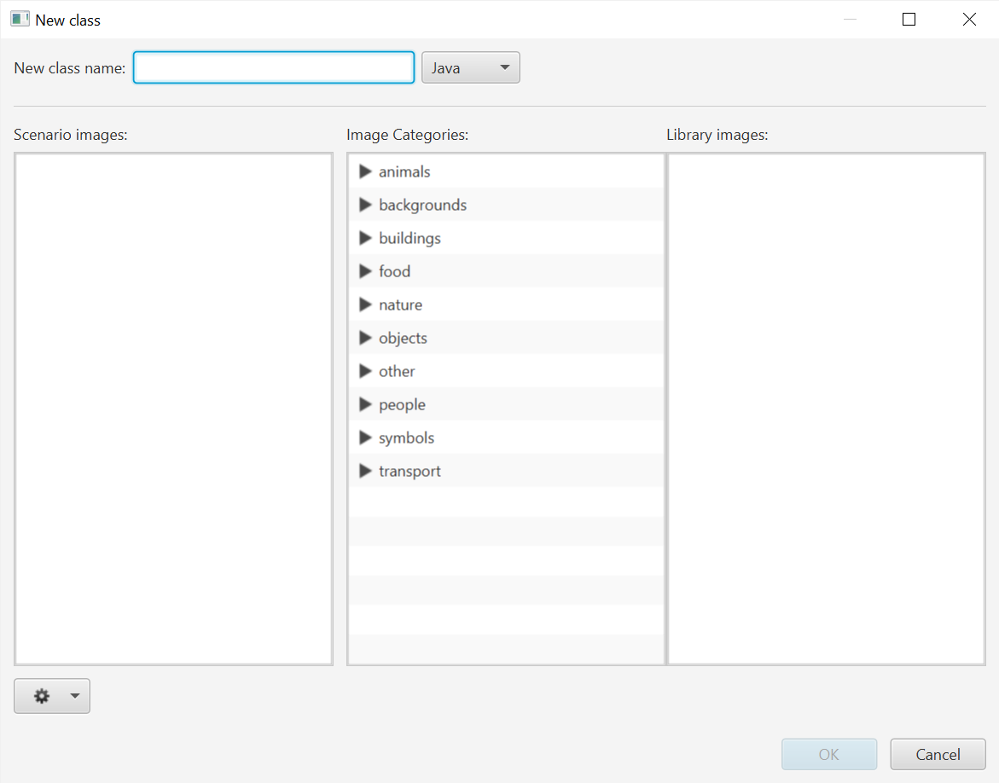
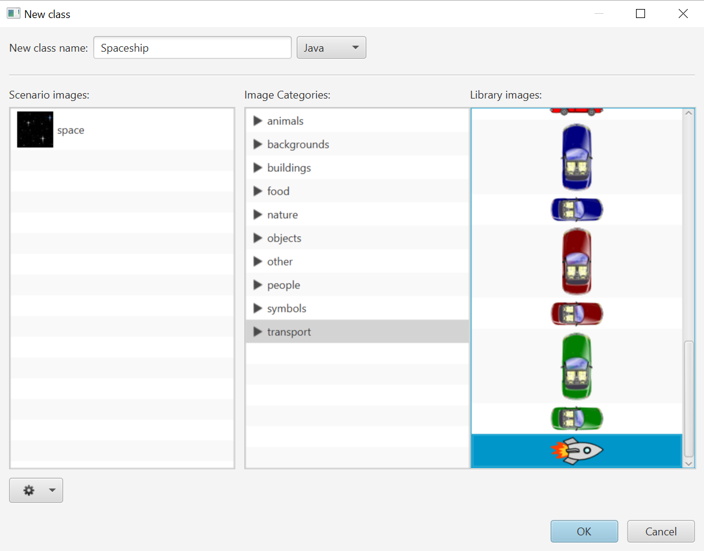

# Lesson 5 - using Greenfoot

## lesson 5.1 - Using Greenfoot

1.What is Greenfoor

Greenfoor is a free interactive development environment for java, specically designed fo edcuational purpose.

2.Installing Greenfoot

[Download Greenfoot](http://www.greenfoot.org/)

3.Starting to Use Greenfoot

This is what you should see when you first start Greenfoot


You can create a new scenario (i.e. project), and you will be asked to provide a location for it. However, it would be better to create a new folder for your new scenario. After you create the scenario you will see the Greenfoot window as shown below:


As you can see from the title of the window, the new scenario we have created is called *HelloWorld*. All you need to do is to create a subclasss for the **World** Class and some subclasses for the **Actor** class.

4.The World Class

*The World class* is the base class of the 'world' of your Greenfoot program. For example, if we want to create a game about space we can create a space world like this:


5.The Actor Class

The **Actor** class is the base class of 'actors' that you want to put into your world. The **Actor** class also provides many useful properties and methods that you can use to program with your actors.

For example, we can put a space ship into the space world we have created above:


In the next two parts of this lesson, we will discuss how to create and program a new world and some actors in a Greenfoot scenario.

6.Creating a New World

If you want to create your own world, you will need to remove this class and create a subclass of the **World** class.To create a subclass of the **World** class, you can right-click on the **World** class, like this:


After doing that you can see two options in the popup menu. If you click on the first option *Open Documentation*, it will open a webpage containing the documentation of the **World** class. The second option *New subclass* is the one we want to use here. After clicking the second option:



Let's select a space background by going to *Image Categories > backgrounds > space.jpg* . In this window, you also need to give a proper class name for this subclass. Let's call this subclass **Space**.


Once you have added the subclass you cannot really see the space world inside the Greenfoot window. You need to create a new instance of the world in the main window to get the new class working, like this:


If you want to take a look at the code of your new subclass you can right-click on your new class and select *Open editor*.

```java
import greenfoot.*;  // (World, Actor, GreenfootImage, Greenfoot and MouseInfo)

/**
 * Write a description of class Space here.
 * 
 * @author (your name)
 * @version (a version number or a date)
 */
public class Space extends World
{
    /**
     * Constructor for objects of class Space.
     */
    public Space() {
        // Create a new world with 600x400 cells with a cell size of 1x1 pixels.
        super(600, 400, 1);
    }
}
```

There is essentially one line of useful code in the class, i.e.:

```java
super(600,400,1);
```

The **super** method is the constructor of the base class, i.e. the **World** class. The overall size of the world is then specified by how many cells in the x direction (number of columns), how many cells in the y direction (number of rows) and the size of the square, like this:


You can change the parameters so that there are 300 cells in the horizontal direction, 200 cells in the vertical direction and the cell size remains as 1, like this:

```java
super(300, 200, 1);
```

The above line of code will create the world as shown below:


7.Creating a New Actor

You have the world ready from the previous part of the lesson. Let's add some actors into the world. To create a subclass of the **Actor** class you go to the right hand side of the Greenfoot window and right-click on the **Actor** class, like this:





After creating a new instance of the **Spaceship** class, you can drag and put the **spaceship** object anywhere inside the world. For instance, you can put the spaceship near the top left hand corner of the world.

Here is an expample where three different actors are created and put on the space world:


## lesson 5.2 -  Creating a Spaceship in a Game

1.Adding a Spaceship in the World

In the rest of this leesson we will discuss how to make a spaceship game. As the first step, we will make a spaceship.

Here is how the spaceship works. The player can control the spaceship to move using a combination of the left, right and up arrow keys. The movement control of the spaceship is shown below:


We will use the space world and the spaceship we have created in the previous part of lesson to make the game. After initializing the size of the game world let's add our spaceship here. When you manually
create your spaceship you need to create an instance of the spaceship by right-clicking on the **Spaceship** class. Equivalently we can create an instance of a spaceship using one line of code:

```java
Spaceship spaceship = new Spaceship();
```

At this stage, the spaceship is in the memory only. It is not anywhere in the display of the world. Greenfoot provides a handy method for us to put any actor in the world. The method is called **addObject**, which is a method of the **World** class (which means the method is inherited by all its subclasses).

```java
addObject(spaceship, 300, 200);
```

The above line of code means that we put the newly created spaceship object in the world at the location (300, 200).

2.Making the Player Move

We have put the spaceship in the space world. However, it cannot move. To make any actor move we have to write the corresponding code in the actor's class. Before we write the code, let's look at the use of the **act** method. If you look at the Greenfoot window you can see there are a few buttons at the bottom, as shown below:


If you press the *Act* button, the **act** methods of all current objects in the scenario, i.e. the world and all the actors inside the scenario, will be run. Instead of pressing the *Act* button continuously you can press the *Run* button. If you do that the **act** methods will be automatically run continuously. How fast the methods are going to be run can be controlled by the *Speed* slider. You can choose to run them fast or slow.

Let's change the **act** method of the spaceship into this:

```java
public void act()
{
    move(4);
}
```

The above code means the spaceship moves four cells in one unit of time. (The **move** method is inherited from the base class Actor)

3.Turning the Player Using the Keyboard

Instead of using the **move** method, we can use the **turn** method to turn, i.e. rotate, the spaceship. You need to give one parameter to the **turn** method. The parameter determines the angle (in degrees) you want to turn the actor.

> A positive angle means turning to the right and a negative angle means turning to the left.

```java
public void act()
{
    turn(3);
}
```

If you run the scenario, you will see your spaceship turning continuously to the right, like this:


However, we don't really want the spaceship to turn by itself! We want the player to control it using the left and right arrow keys. Greenfoot provides a useful method from the **Greenfoot** class called **isKeyDown**.

```java
if (Greenfoot.isKeyDown("left")) {
    ...
}
```

We simply run the **turn** method only if the left arrow key has been pressed, like this:

```java
public void act()
{
    if (Greenfoot.isKeyDown("left")) {
        turn(-3);
    }
}
```

4.Finishing the Player Control

Now, we can combine what we have before to finish the player control.

Here is the code of the act method for controlling the spaceship:

```java
public void act()
{
    // Rotate the spaceship based on the key pressed
    if (Greenfoot.isKeyDown("left")) {
        turn(-3);
    }
    else if (Greenfoot.isKeyDown("right")) {
        turn(3);
    }

    // Move the spaceship based on the key pressed
    if (Greenfoot.isKeyDown("up")) {
        move(4);
    }
}
```

## lesson 5.3 - Creating an Enemy in the Game

1.Creating a Rock Actor

Just having a spaceship is not a playable game. Let's add some enemies to the game.

In this part of the lesson we will add some rocks to the game. Let's create a new subclass called **Rock** and then use an image from *Image Categories > nature > rock.png* in the new class window, as shown below:


2.Moving the Rock Randomly

The rock is the enemy in the game. It would be great if the rock randomly os that the player has to control the spaceship ot stay away from the rock. To do that, first we will learn to use a method called **getRandomNUmber** from the **Greenfoot** class.

The **getRandomNumber** method takes a single parameter and then returns a random number from 0 up to but excluding the input parameter. Here is an example:

```java
int number - Greenfoot.getRandomNumber(10);
```

The above code generates a random number and puts the number into the **number** variable.

Since we want to turn the rock at the very start we can put the code in the constructor of the **Rock** class. At the moment, the constructor is not in the code of the class so we have to manually create it like this:

```java
public Rock()
{
    super();

    // Randomly turn the rock
    turn(Greenfoot.getRandomNumber(360));
}
```

Therefore, the above code turns the rock in a random direction.


3.Automatically
